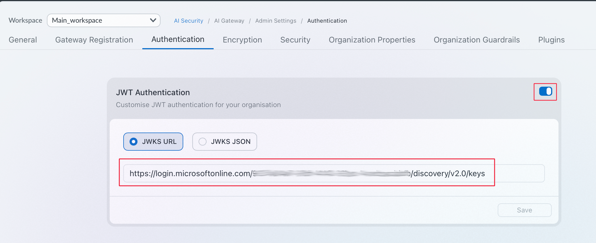
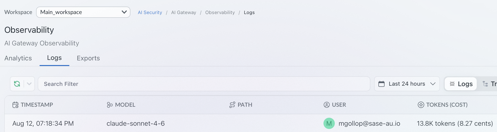

# EntraID (OIDC/JWT) Authentication for Claude Desktop

> **Version 2.** This guide supersedes the previous revision of this document. If you set up JWT auth against an earlier version of this guide, re-run through the steps below in full — the claims configuration surface has changed and the two approaches should not be mixed.

Configures Claude Desktop to authenticate against this self-hosted AIGW Gateway (although this process works with the SaaS AIGW offering too) using Microsoft EntraID as the OIDC identity provider, with JWT bearer tokens validated by the gateway. User and workspace assignment is driven entirely by **Entra security groups**, so adding or moving a user is a group-membership change — no per-user policy edits.

## Prerequisites

- This repo's `docker-compose.yml` stack running
  - `JWT_ENABLED: ON`
- An EntraID tenant with permissions to register applications and manage Enterprise Application properties (Application Administrator or Cloud Application Administrator)
- `openssl` installed locally (for generating the token-signing certificate in step 3)
- Claude Desktop installed, with the Developer menu enabled (step 1 below)

## 1. Enable the Developer menu in Claude Desktop

The 3rd-party provider / OIDC configuration UI referenced in step 9 lives behind Claude Desktop's Developer menu, which is hidden by default. Enable it before continuing (Help → Troubleshooting → Enable Developer Mode, or the equivalent toggle for your Claude Desktop version).


## 2. Register the application

In the [Entra Admin Center](https://entra.microsoft.com), go to **App registrations → New registration**.


- **Name**: something identifiable, e.g. `aigw-jwt-app`
- **Supported account types**: Single tenant
- **Redirect URI**: add the **loopback port Claude Desktop will use** (`http://localhost:8080` in this example) — platform type "Web"


Note the **Application (client) ID** and **Directory (tenant) ID** from the app's Overview page — both are needed throughout this guide, and the tenant ID doubles as part of the **OIDC Issuer URL**: `https://login.microsoftonline.com/<tenant-id>/v2.0`.

## 3. Generate and upload a token-signing certificate

Customizing claims on this app (step 6) requires a certificate — Entra signs tokens with a custom key once you add custom claims, instead of the default Microsoft key. Generate a self-signed certificate and upload the public half:

```sh
openssl req -x509 -newkey rsa:2048 \
  -keyout key.pem -out cert.pem \
  -days 365 -nodes \
  -subj "/CN=PortkeyTokenSigningKey"
```

In **App registrations → your app → Certificates & secrets → Certificates → Upload certificate**, upload `cert.pem` (the public key only — never upload or share `key.pem`).


Keep `key.pem` safe — treat it like any other private key material. It is not consumed by the gateway or by Claude; it only needs to exist so the certificate it backs is valid.

## 4. Patch the manifest

In the app's **Manifest** tab, set two fields under `"api"`:

```json
"api": {
  "acceptMappedClaims": true,
  "requestedAccessTokenVersion": 2,
  ...
}
```


- `requestedAccessTokenVersion: 2` — without this, EntraID issues v1.0 tokens whose issuer (`https://sts.windows.net/<tenant-id>/`) won't match the v2.0 issuer URL used in step 9, causing authentication to fail.
- `acceptMappedClaims: true` — required for the app to emit the custom claims configured in step 6.

Click **Save**.

## 5. Restrict and assign access via the Enterprise Application

In the [Entra Admin Center](https://entra.microsoft.com), go to **Enterprise applications → All applications** and search for your app by name — the App Registration above automatically has a matching Enterprise Application (service principal).


### 5a. Require assignment

Under **Properties**, set **Assignment required?** to **Yes**. This is what makes group membership meaningful — without it, any user in the tenant can sign in and get a token regardless of group assignment below.


### 5b. Assign the groups that should have access

Under **Users and groups → Add user/group**, assign the security group(s) whose members should be able to use this gateway (e.g. `AIRS Group`). Only members of an assigned group can sign in once assignment is required.


> **Onboarding a new user**: add them to the appropriate Entra group. No app registration change, no policy edit, no restart — their next sign-in picks up access and claims automatically. This is the mechanism for allocating users "on the fly."

## 6. Configure claims

Still on the Enterprise Application, go to **Single sign-on → OIDC-based Sign-on → Attributes & Claims → Edit**.


Add the claims the gateway needs as **Additional claims** (use **+ Add new claim**, source = typed constant value, not an attribute):

| Claim name | Value | Purpose |
|---|---|---|
| `portkey_oid` | Your deployment's `ORGANISATIONS_TO_SYNC` UUID | Org routing — the gateway rejects tokens missing this |
| `portkey_workspace` | A workspace slug, e.g. `ws-main-a-997260` | Workspace routing |
| `scopes` | e.g. `completions.write` | Overrides `JWT_LOCAL_AUTH_DEFAULT_SCOPES` explicitly |


**NOTE: ** You can choose to leave out the portkey_workspace and leverage SCIM group assignment to allocate the workspace. Upon authentication the gateway will scan for valid users based on the UPN or email and assign them to the approiate workspace. 

### Group-based claim values (multi-team / multi-workspace)

If different teams need different workspaces, don't hardcode a single `portkey_workspace` value. Instead, add **claim conditions** scoped to a group, with a distinct value per group:


With this in place, the same claim resolves differently depending on which group signs in — add one claim condition row per group, each with its own `portkey_workspace` value, instead of a single static value in the table above. This is the alternative to the SCIM-based group-to-workspace mapping mentioned above, for deployments that would rather drive workspace assignment directly from the EntraID claim.

Click **Save**.

## 7. Get the Application (client) ID

From either the App Registration's Overview or the Enterprise Application's Overview — they share the same **Application ID**.


## 8. Configure the Vertex integration

In the AIGW control plane, add an integration for `@vertex` and select the models you want available through this gateway.

## 9. Create an AIGW config

Create a config that routes to the Vertex integration, e.g.:

```json
{
  "retry": {
    "attempts": 3
  },
  "cache": {
    "mode": "simple"
  },
  "provider": "@vertex"
}
```

Save it and note the generated **config ID** — it's used in step 11.

## 10. Enable JWT Authentication

Enable JWT Authentication in the AIGW control plane and point it at your EntraID app (tenant ID from step 2).



## 11. Configure the 3rd-party (OIDC) provider in Claude Desktop

In Claude Desktop's Developer menu, add a 3rd-party provider pointing at the local hybrid gateway container, with OIDC authentication:

| Field | Value |
|---|---|
| Base URL | This gateway's URL (e.g. `http://localhost:8787`) |
| Client ID | The Application (client) ID from step 7 |
| Issuer URL | The EntraID tenant issuer URL from step 2 |
| Bearer token type | ID Token |
| Scopes | `openid profile email offline_access` |
| Redirect port | `8080` (must match the redirect URI registered in step 2) |

Sample configuration:

```json
{
  "inferenceGatewayBaseUrl": "http://127.0.0.1:8787",
  "inferenceCustomHeaders": "[redacted]",
  "inferenceGatewayOidcAuthFlow": "browser",
  "inferenceGatewayOidc": {
    "clientId": "c5490456-8e83-4df6-a979-9ed2b4dd84a5",
    "issuer": "https://login.microsoftonline.com/<TenantID>/v2.0",
    "bearerTokenType": "id_token",
    "scopes": "openid profile email offline_access",
    "appendOfflineAccess": true,
    "redirectPort": 8080
  },
  "chatTabEnabled": true,
  "modelDiscoveryEnabled": true,
  "inferenceModels": [],
  "inferenceProvider": "gateway",
  "inferenceCredentialKind": "interactive"
}
```

Finally, add a custom header so every request carries the AIGW config from step 9:

```
x-portkey-config: <config-id>
```

## Verifying it works

1. In Claude Desktop, trigger the OIDC login flow for the provider you just added — it should open a browser to EntraID, authenticate, and redirect back to `localhost:8080`.
2. Send a message through Claude Desktop using this provider.
3. Decode the resulting token at [jwt.ms](https://jwt.ms) or via `cut`/`base64`/`python3 -m json.tool` and confirm `portkey_oid`, `portkey_workspace`, and `scopes` are present and correct for the signed-in user's group:

   

   A user in a different group gets different claim values from the same app, with no per-user configuration:

   

4. Confirm requests are landing in AIGW's control plane logs/analytics for the mapped workspace.

   

## Troubleshooting

- **User can sign in but gets no/wrong `portkey_workspace`** — they're not a member of any group referenced by a claim condition in step 6. Add them to the correct group.
- **User can't sign in at all** — confirm **Assignment required?** is `Yes` (step 5a) and the user is a member of an assigned group (step 5b).
- **Claims don't appear in the token** — claims must be added under **Enterprise Applications → your app → Single sign-on → Attributes & Claims**, not under the App Registration's **Token configuration** tab — these are two different systems and only the former supports the group-conditioned values used here. Also confirm the certificate from step 3 is uploaded; Entra silently ignores custom claims without a signing certificate.
- **401 Unauthorized** — verify `JWT_ENABLED: ON` and `JWT_LOCAL_AUTH_DEFAULT_SCOPES` are set on the gateway (see [docker-compose.yml](../docker-compose.yml)), and that the ID token actually contains `portkey_oid` and `scopes` (decode it at [jwt.ms](https://jwt.ms)).
- **Org/workspace not resolved** — double check `portkey_oid` in the token matches this deployment's `ORGANISATIONS_TO_SYNC` env var exactly.
- **Redirect fails / stuck on EntraID** — confirm the redirect URI registered in EntraID (step 2) exactly matches the redirect port configured in Claude Desktop (step 11), including `http://localhost:<port>`.
- **Authentication fails right after setup with an issuer mismatch** — confirm `requestedAccessTokenVersion: 2` was saved in the manifest (step 4); a v1.0 token's issuer won't match the v2.0 issuer URL configured in step 11.
