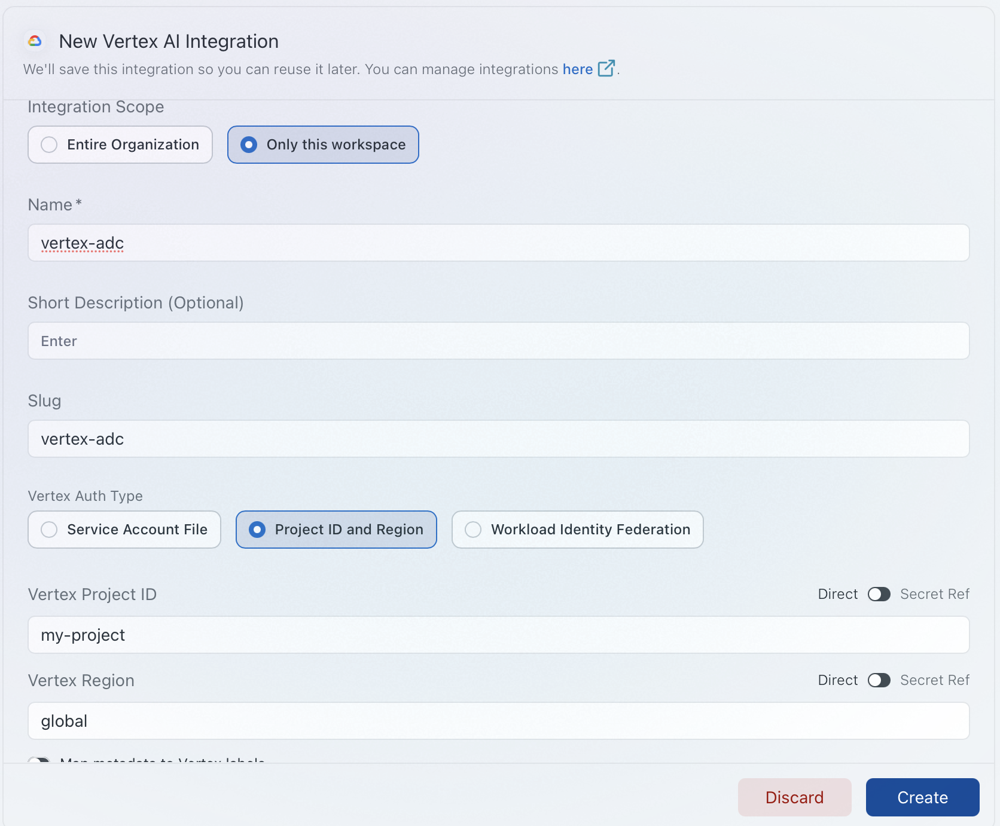

# Claude Code CLI — Vertex AI via AIGW using Google ADC

Configures the Claude Code CLI to route requests through the AIGW gateway to **Anthropic Claude models on Google Vertex AI**, authenticated with a short-lived Google Cloud access token obtained from your local **Application Default Credentials (ADC)**. No service account JSON key is required — the gateway forwards your own `gcloud` token to Vertex on each request.

## How it works

The trick is that Claude Code runs in its **standard Anthropic-API mode** (not its native Vertex mode) and points at the gateway. In native Vertex mode Claude Code builds a Vertex-specific URL path and disables `apiKeyHelper`, so it cannot be pointed at the gateway. In Anthropic-API mode it simply appends `/v1/messages` to `ANTHROPIC_BASE_URL` and sends the `apiKeyHelper` output as `Authorization: Bearer`.

The gateway is configured (via a Portkey **virtual key**) with only a GCP project + region — no service account key — so it reads the OAuth2 access token off the incoming `Authorization` header and forwards it to Vertex. That token is your ADC token, produced fresh by `gcloud auth print-access-token`.

```
Claude Code CLI  (standard Anthropic-API mode)
    │
    ├── apiKeyHelper: gcloud auth print-access-token → ADC access token
    │
    └── POST https://aigw.portkey.ai/v1/messages
            Authorization: Bearer <adc-token>
            x-portkey-virtual-key: vertex-adc
            x-portkey-api-key:     <portkey-key>
            │
            └── gateway forwards ADC token → Vertex AI (Anthropic Claude)
```

`apiKeyHelper` output is copied into both `Authorization: Bearer` and `x-api-key`; the gateway authenticates its own account off `x-portkey-api-key`, so the stray `x-api-key` is ignored — harmless.

## Prerequisites

- Google Cloud SDK (`gcloud`) installed and initialised
- ADC established for a principal with Vertex AI access:
  ```sh
  gcloud auth login
  gcloud auth application-default login   # if any tooling needs ADC directly
  ```
  For Claude Code itself, `gcloud auth print-access-token` only needs an active `gcloud` login.
- A Portkey **virtual key** (e.g. `vertex-adc`) configured on the AIGW with your GCP **project ID + region** and *no* service account JSON, so it accepts a caller-supplied token
- Claude Code CLI **v2.1.227+** (required for `ANTHROPIC_CUSTOM_HEADERS`)

## 1. Set up the Vertex provider in the AIGW catalog

In the Portkey control plane, add Vertex AI as a provider in the **model catalog** and create the **virtual key** (`vertex-adc` in this guide) that Claude Code will reference.

The key detail for ADC: when configuring the Vertex integration, supply only the **Vertex Project ID** and **Region** — do **not** upload a service account JSON key. With no stored credential, the gateway falls back to the OAuth2 access token on the incoming `Authorization` header, which is exactly the ADC token Claude Code sends.



Note the region: it must be one where your Vertex project has the target Anthropic Claude models enabled.

## 2. Confirm the token flow with curl

Before touching Claude Code, prove the end-to-end path works:

```sh
TOKEN=$(gcloud auth print-access-token) && \
curl https://aigw.portkey.ai/v1/messages \
  -H "x-portkey-virtual-key: vertex-adc" \
  -H "x-portkey-api-key: <your-portkey-key>" \
  -H "Authorization: Bearer $TOKEN" \
  -H "Content-Type: application/json" \
  -d '{"model": "anthropic.claude-sonnet-4-6", "max_tokens": 250, "messages": [{"role": "user", "content": "hi"}]}'
```

A successful response looks like:

```json
{"model":"claude-sonnet-4-6","id":"msg_vrtx_...","type":"message","role":"assistant",
 "content":[{"type":"text","text":"Hi there! ..."}],"stop_reason":"end_turn", ...}
```

> **Model prefix**: Vertex routing requires the `anthropic.` prefix on model names (e.g. `anthropic.claude-sonnet-4-6`). Without it the gateway returns `messages is not supported by vertex-ai`.

## 3. Configure Claude Code CLI

Edit (or create) `~/.claude/settings.json`:

```json
{
  "apiKeyHelper": "gcloud auth print-access-token",
  "env": {
    "ANTHROPIC_BASE_URL": "https://aigw.portkey.ai",
    "ANTHROPIC_CUSTOM_HEADERS": "x-portkey-virtual-key: vertex-adc\nx-portkey-api-key: <your-portkey-key>",
    "ANTHROPIC_DEFAULT_SONNET_MODEL": "anthropic.claude-sonnet-4-6",
    "ANTHROPIC_DEFAULT_OPUS_MODEL": "anthropic.claude-opus-4-8",
    "ANTHROPIC_DEFAULT_HAIKU_MODEL": "anthropic.claude-haiku-4-5@20251001",
    "CLAUDE_CODE_API_KEY_HELPER_TTL_MS": "3000000"
  }
}
```

| Field | Value |
|---|---|
| `apiKeyHelper` | `gcloud auth print-access-token` — emits a fresh ADC access token on each refresh |
| `ANTHROPIC_BASE_URL` | The gateway host; Claude Code appends `/v1/messages` |
| `ANTHROPIC_CUSTOM_HEADERS` | Newline-separated (`\n`) header pairs — the Portkey virtual key and account API key |
| `ANTHROPIC_DEFAULT_SONNET_MODEL` | Model the `sonnet` alias resolves to — sent **verbatim** to the gateway (must carry the `anthropic.` prefix) |
| `ANTHROPIC_DEFAULT_OPUS_MODEL` | Model the `opus` alias resolves to |
| `ANTHROPIC_DEFAULT_HAIKU_MODEL` | Model the `haiku` alias resolves to — used for background/fast tasks, so it **must** resolve to a working Vertex model |
| `CLAUDE_CODE_API_KEY_HELPER_TTL_MS` | Refresh interval in ms — `3000000` (50 min) refreshes ahead of the ~1 h ADC token expiry |

### Why the model-override vars are required

Claude Code normally sends bare model IDs (`claude-sonnet-4-6`). Vertex routing needs the `anthropic.` prefix. Because `ANTHROPIC_BASE_URL` points at a gateway (a non-Anthropic host), Claude Code passes any model string through **verbatim without validation** — so setting the alias vars to `anthropic.…` values makes it emit exactly what Vertex expects. Against the direct Anthropic API these custom strings would be rejected; through the gateway they are not.

> **Deprecated var**: use `ANTHROPIC_DEFAULT_HAIKU_MODEL`, not the old `ANTHROPIC_SMALL_FAST_MODEL`.

## 4. Token refresh — automatic

`apiKeyHelper` output is cached and re-run:

- on the `CLAUDE_CODE_API_KEY_HELPER_TTL_MS` interval (50 min above), and
- immediately on any HTTP `401` response.

So hourly ADC expiry is handled without restarting Claude Code, as long as your underlying `gcloud` session is valid. If `gcloud` itself has expired you'll need to `gcloud auth login` again.

## 5. Start Claude Code

```sh
claude
```

To confirm requests are landing in the gateway, check the AIGW control plane logs / analytics for your workspace, or watch for the model echoed back without the prefix (`"model":"claude-sonnet-4-6"`).

## Notes & side effects

- **Secret in plaintext**: the `x-portkey-api-key` lives unencrypted in `settings.json`. Keep it out of any synced/committed dotfiles. The GCP token stays ephemeral via the helper.
- **MCP tool-search & Remote Control** are disabled by default when `ANTHROPIC_BASE_URL` is a non-Anthropic host. Re-enable tool search with `ENABLE_TOOL_SEARCH=true` if you need it.
- `content-type` and `anthropic-version` headers are added by Claude Code automatically — you don't set them.

## Troubleshooting

| Symptom | Likely cause | Fix |
|---|---|---|
| `messages is not supported by vertex-ai` | Model name missing `anthropic.` prefix | Ensure the `ANTHROPIC_DEFAULT_*_MODEL` values start with `anthropic.` |
| Custom model string rejected at startup | `ANTHROPIC_BASE_URL` not set (Claude Code validating against Anthropic API) | Confirm `ANTHROPIC_BASE_URL` points at the gateway |
| Custom headers ignored / `x-portkey-*` missing | Claude Code older than v2.1.227 | Upgrade Claude Code |
| `401 Unauthorized` from gateway | ADC token expired or lacks Vertex access | `gcloud auth login`; verify the principal has Vertex AI User on the project |
| `403` / permission denied from Vertex | Token valid but principal not authorised on the Vertex project | Grant `roles/aiplatform.user`; check the virtual key's project/region |
| Background tasks failing only | `ANTHROPIC_DEFAULT_HAIKU_MODEL` resolves to a model not available on the virtual key | Test that exact haiku model with the curl in step 1 |
| Token is a literal string, not a token | Command substitution error in a manual curl | Use `$(gcloud auth print-access-token)`, not braces |
| `gcloud: command not found` | Cloud SDK not installed / not on `PATH` | Install the Google Cloud SDK and re-open the shell |

**Verify the token flow manually at any time** using the curl in [step 2](#2-confirm-the-token-flow-with-curl).

## Updating credentials

- **Rotate the Portkey key or virtual key**: update the `ANTHROPIC_CUSTOM_HEADERS` value in `~/.claude/settings.json`.
- **Switch GCP identity**: `gcloud auth login` (and `gcloud config set project <id>` if needed); the helper picks up the new token automatically.
- **Change project/region**: update the AIGW virtual key configuration — no client-side change needed.
