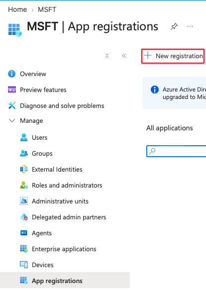
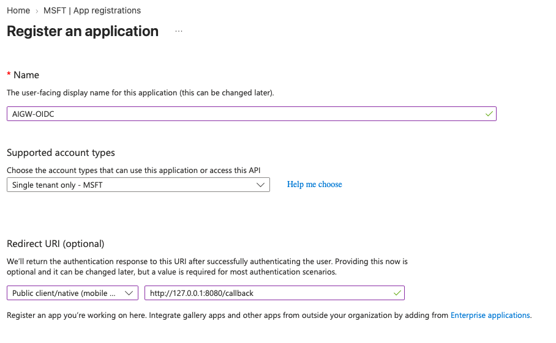
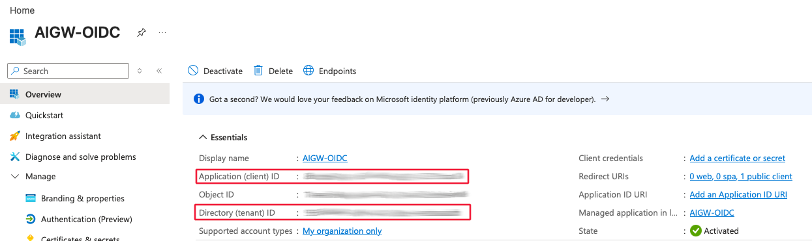
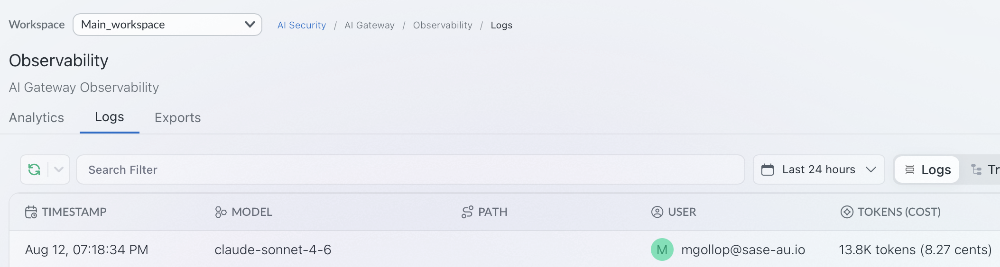

# EntraID (OIDC/JWT) Authentication for Claude Desktop

Configures Claude Desktop to authenticate against this self-hosted AIGW Gateway using Microsoft EntraID as the OIDC identity provider, with JWT bearer tokens validated by the gateway.

## Prerequisites

- This repo's `docker-compose.yml` stack running
  -  `JWT_ENABLED: ON` (already set — see [docker-compose.yml](../docker-compose.yml))
  - `JWT_LOCAL_AUTH_DEFAULT_SCOPES: completions.write,mcp.invoke` (already set — see [docker-compose.yml](../docker-compose.yml))- This is required as EntraID is not setting the scope
- An EntraID tenant with permissions to register an application (entra.microsoft.com)
- Claude Desktop installed, with the Developer menu enabled (step 1 below)

## 1. Enable the Developer menu in Claude Desktop

The 3rd-party provider / OIDC configuration UI referenced in step 6 lives behind Claude Desktop's Developer menu, which is hidden by default. Enable it before continuing (Help → Troubleshooting → Enable Developer Mode, or the equivalent toggle for your Claude Desktop version).


## 2. Register the application in EntraID

In the [Entra Admin Center](https://entra.microsoft.com):


1. Register a new application (App registrations → New registration).

App Registration" width="380">

2. Add a redirect URI for the **loopback port Claude Desktop will use** — see step 6 (`http://localhost:8080` in this example).

App Configuration" width="600">

3. Note the **Application (client) ID** and the **Application tenant ID** (You will use it as the **OIDC Issuer URL**`https://login.microsoftonline.com/<tenant-id>/v2.0`) — both are needed in step 6.



## 3. Configure custom claims

The gateway requires specific claims in the ID token to identify the user and map them to the correct Portkey workspace. Several of these (e.g. `onPremisesSamAccountName`) are not emitted in a standard EntraID token, so they must be injected via an **EntraID Claims Mapping Policy** — a tenant-level policy that rewrites or adds claims before the token is issued.

> **Tip:** The `Setup-EntraID-App.sh` script supplied with this deployment automates steps 3a–3d below, including creating the policy, assigning it to the service principal, and enabling `acceptMappedClaims`. You can use it instead of following the manual steps.

### 3a. Add optional ID-token claims

In the Entra Admin Center, go to **App registrations → your app → Token configuration** and add the following as optional claims on the **ID** token:

| Claim name | Purpose |
|---|---|
| `upn` | User principal name |
| `email` | User's email address |
| `preferred_username` | Display name / login hint |

These are available natively and can be added through the UI without a custom policy.

### 3b. Create a Claims Mapping Policy

The remaining claims require a Claims Mapping Policy, which must be created via the **Microsoft Graph API** or Azure CLI (there is no UI for this). The policy should be defined as follows, substituting your deployment-specific values where indicated:

```json
{
  "definition": [
    "{\"ClaimsMappingPolicy\":{\"Version\":1,\"IncludeBasicClaimSet\":\"true\",\"ClaimsSchema\":[
      {\"Source\":\"user\",\"ID\":\"jobtitle\",           \"JwtClaimType\":\"jobtitle\"},
      {\"Source\":\"user\",\"ID\":\"department\",          \"JwtClaimType\":\"department\"},
      {\"Source\":\"user\",\"ID\":\"onpremisessamaccountname\",\"JwtClaimType\":\"uid\"},
      {\"Source\":\"user\",\"ID\":\"mailnickname\",        \"JwtClaimType\":\"mailnickname\"},
      {\"Source\":\"user\",\"ID\":\"mail\",                \"JwtClaimType\":\"email_id\"},
      {\"Source\":\"user\",\"ID\":\"mailnickname\",        \"JwtClaimType\":\"_user\"},
      {\"Value\":\"<your-workspace-slug>\",               \"JwtClaimType\":\"portkey_workspace\"},
      {\"Value\":\"<your-ORGANISATIONS_TO_SYNC-uuid>\",   \"JwtClaimType\":\"portkey_oid\"}
    ]}}"
  ],
  "displayName": "PortkeyClaimsMappingPolicy",
  "type": "ClaimsMappingPolicy"
}
```

The claims this policy injects are:

| JWT claim | Source | Notes |
|---|---|---|
| `jobtitle` | `user.jobtitle` | |
| `department` | `user.department` | |
| `uid` | `user.onPremisesSamAccountName` | Requires on-prem AD sync |
| `mailnickname` | `user.mailNickname` | |
| `email_id` | `user.mail` | Primary user identity for the gateway |
| `_user` | `user.mailNickname` | Internal user identifier |
| `portkey_workspace` | Static value **or** extension attribute | See note below |
| `portkey_oid` | Static value | Must match your deployment's `ORGANISATIONS_TO_SYNC` |

The most load-bearing claims are `email_id` (user identity) and `portkey_oid` (org routing). The gateway will reject tokens that are missing either.

#### Sourcing `portkey_workspace`

You have two options for this claim:

| Option | Policy entry | When to use |
|---|---|---|
| **Static value** | `{"Value":"ws-main-a-997260","JwtClaimType":"portkey_workspace"}` | All users share a single workspace |
| **User extension attribute** | `{"Source":"user","ID":"extensionattribute1","JwtClaimType":"portkey_workspace"}` | Per-user workspace assignment — set the workspace slug on each user's `extensionAttribute1`–`15` in Entra or on-prem AD |

The extension-attribute approach is recommended for multi-workspace deployments: the value is read from the user object at token issuance time, so users can be reassigned to different workspaces without any policy change.

> **Note on group-based sourcing:** Claims Mapping Policies do not support deriving a single claim value from group membership — the `groups` claim returns an array of GUIDs, not a workspace slug. If you need workspace assignment driven by group membership, use [dynamic group rules](https://learn.microsoft.com/en-us/entra/identity/users/groups-dynamic-membership) to keep membership in sync, and write the workspace slug back to an `extensionAttribute` on the user via a provisioning flow.

### 3c. Assign the policy to the service principal

After creating the policy, assign it to the app's service principal:

```
POST https://graph.microsoft.com/v1.0/servicePrincipals/{servicePrincipalId}/claimsMappingPolicies/$ref

Body: {"@odata.id": "https://graph.microsoft.com/v1.0/policies/claimsMappingPolicies/{policyId}"}
```

### 3d. Enable `acceptMappedClaims` on the app registration

Without this, EntraID returns a `400` when the mapped token is exchanged. Patch the application object:

```
PATCH https://graph.microsoft.com/v1.0/applications/{appObjectId}

Body: {"api": {"acceptMappedClaims": true}}
```

### 3e. Managing the policy with `az` commands

All policy operations can be performed using `az rest` after logging in with `az login` (or `az login --allow-no-subscriptions` if your account has no subscription).

**Find the policy ID** (if you don't already have it):
```sh
az rest --method GET \
  --uri "https://graph.microsoft.com/v1.0/servicePrincipals/{servicePrincipalId}/claimsMappingPolicies" \
  --query "value[].{id:id, name:displayName}"
```

**View the full policy definition:**
```sh
az rest --method GET \
  --uri "https://graph.microsoft.com/v1.0/policies/claimsMappingPolicies/{policyId}"
```

**Update (replace) the policy definition:**

Build the updated definition as a JSON string — note the inner policy object must be serialised as an escaped string inside the `definition` array:

```sh
az rest --method PATCH \
  --uri "https://graph.microsoft.com/v1.0/policies/claimsMappingPolicies/{policyId}" \
  --headers "Content-Type=application/json" \
  --body '{
    "definition": [
      "{\"ClaimsMappingPolicy\":{\"Version\":1,\"IncludeBasicClaimSet\":\"true\",\"ClaimsSchema\":[
        {\"Source\":\"user\",\"ID\":\"jobtitle\",              \"JwtClaimType\":\"jobtitle\"},
        {\"Source\":\"user\",\"ID\":\"department\",             \"JwtClaimType\":\"department\"},
        {\"Source\":\"user\",\"ID\":\"onpremisessamaccountname\",\"JwtClaimType\":\"uid\"},
        {\"Source\":\"user\",\"ID\":\"mailnickname\",           \"JwtClaimType\":\"mailnickname\"},
        {\"Source\":\"user\",\"ID\":\"mail\",                   \"JwtClaimType\":\"email_id\"},
        {\"Source\":\"user\",\"ID\":\"mailnickname\",           \"JwtClaimType\":\"_user\"},
        {\"Value\":\"<workspace-slug>\",                       \"JwtClaimType\":\"portkey_workspace\"},
        {\"Value\":\"<organisations-to-sync-uuid>\",           \"JwtClaimType\":\"portkey_oid\"}
      ]}}"
    ],
    "displayName": "PortkeyClaimsMappingPolicy"
  }'
```

> The `PATCH` replaces the entire `definition` — include all claims you want, not just the ones that changed.

**Verify the update was applied** by fetching a fresh token and inspecting it at [jwt.ms](https://jwt.ms). Changes take effect on the next token issuance; existing cached tokens are unaffected until they expire.

> **Shortcut:** Re-running `Setup-EntraID-App.sh` and choosing an existing app will detect the assigned policy, show its current claims, and offer to update it interactively.

## 4. Configure the Vertex integration

In the AIGW control plane, add an integration for `@vertex` and select the models you want available through this gateway.

## 5. Create a AIGW config

Create a config that routes to the Vertex integration, e.g.:

```json
{
  "retry": {
    "attempts": 3
  },
  "cache": {
    "mode": "simple"
  },
  "provider": "@vertex"
}
```

Save it and note the generated **config ID** — it's used in step 6.

## 6. Configure the 3rd-party (OIDC) provider in Claude Desktop

In Claude Desktop's Developer menu, add a 3rd-party provider pointing at the local hybrid gateway container, with OIDC authentication:

| Field | Value |
|---|---|
| Base URL | This gateway's URL (e.g. `http://localhost:8787`) |
| Client ID | The Application (client) ID from step 2 |
| Issuer URL | The EntraID tenant issuer URL from step 2 |
| Bearer token type | ID Token |
| Scopes | `openid profile email offline_access` |
| Redirect port | `8080` (must match the redirect URI registered in step 2) |

here is a sample configuration:
```
{
  "inferenceGatewayBaseUrl": "http://127.0.0.1:8787",
  "inferenceCustomHeaders": "[redacted]",
  "inferenceGatewayOidcAuthFlow": "browser",
  "inferenceGatewayOidc": {
    "clientId": "9629c204-88db-4e7e-92a8-dda28e451409",
    "issuer": "https://login.microsoftonline.com/<TenantID>/v2.0",
    "bearerTokenType": "id_token",
    "scopes": "openid profile email offline_access",
    "appendOfflineAccess": true,
    "redirectPort": 8080
  },
  "chatTabEnabled": true,
  "modelDiscoveryEnabled": true,
  "inferenceModels": [],
  "inferenceProvider": "gateway",
  "inferenceCredentialKind": "interactive"
}
```


Finally, add a custom header so every request carries the AIGW config from step 5:

```
x-portkey-config: <config-id>
```

## Verifying it works

1. In Claude Desktop, trigger the OIDC login flow for the provider you just added — it should open a browser to EntraID, authenticate, and redirect back to `localhost:8080`.
2. Send a message through Claude Desktop using this provider.
3. Confirm requests are landing in AIGW's control plane logs/analytics for the mapped workspace.
   

## Troubleshooting

- **401 Unauthorized** — verify `JWT_ENABLED: ON` and `JWT_LOCAL_AUTH_DEFAULT_SCOPES` are set on the gateway (see [docker-compose.yml](../docker-compose.yml)), and that the ID token actually contains the custom claims from step 3 (decode it at [jwt.ms](https://jwt.ms) to check).
- **Org/workspace not resolved** — double check `portkey_oid` in the token matches this deployment's `ORGANISATIONS_TO_SYNC` env var exactly. Decode the token at [jwt.ms](https://jwt.ms) to inspect the raw claims.
- **Redirect fails / stuck on EntraID** — confirm the redirect URI registered in EntraID (step 2) exactly matches the redirect port configured in Claude Desktop (step 6), including `http://localhost:<port>`.
